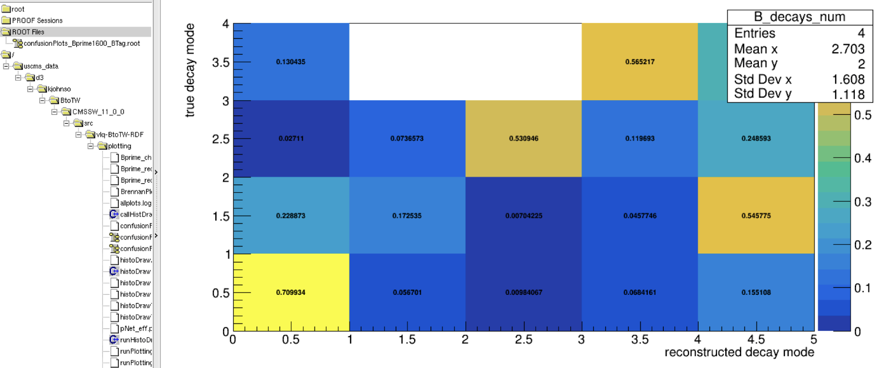
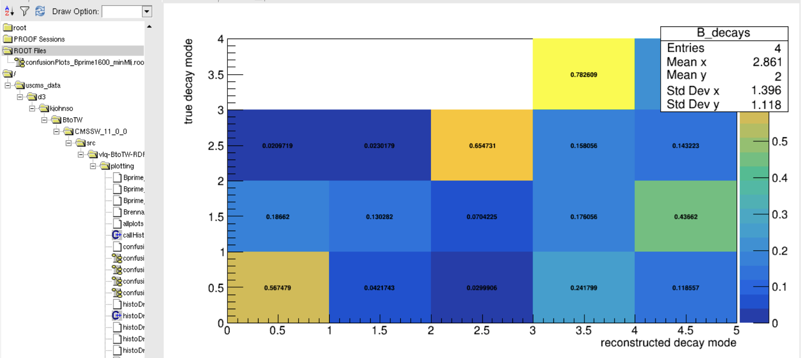
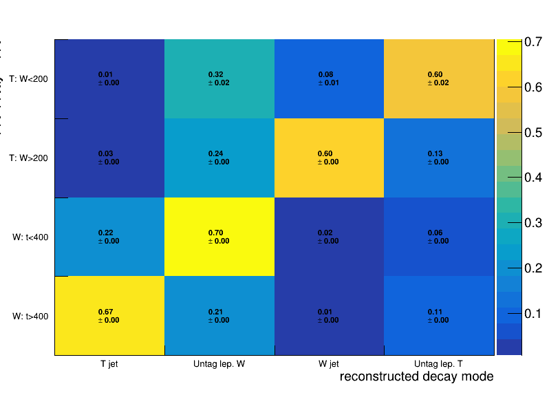
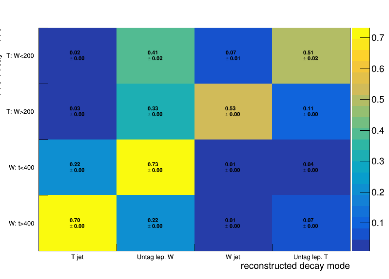
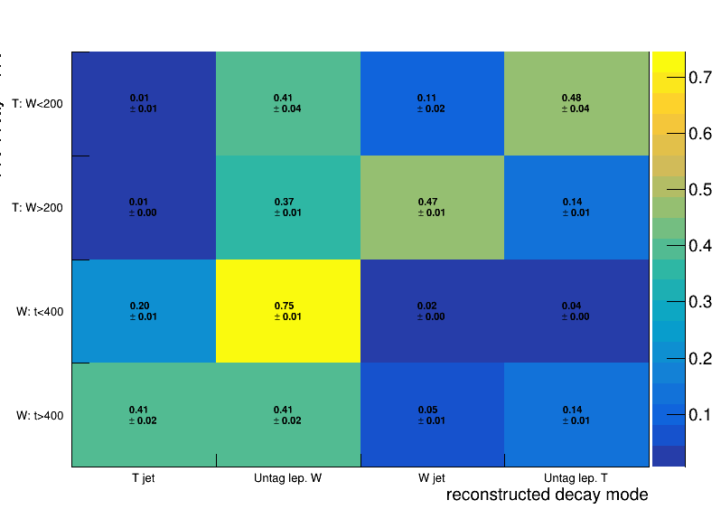
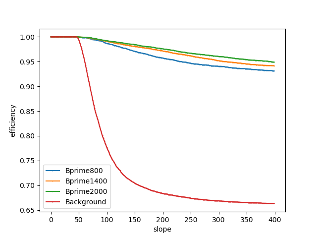
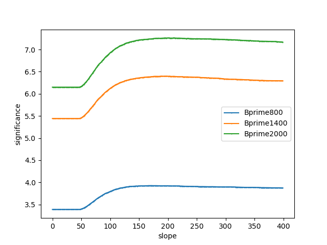
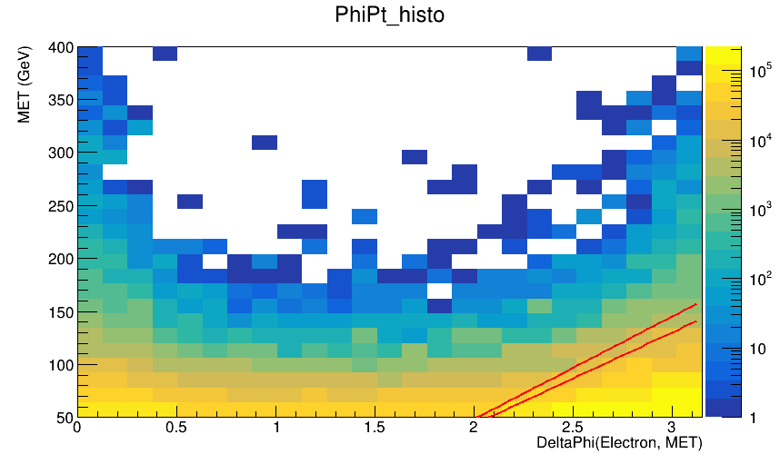

Taking inspiration from the top charge asymmetry [analysis note](https://cms.cern.ch/iCMS/jsp/db_notes/noteInfo.jsp?cmsnoteid=CMS%20AN-2021/069).

Ideas I'm confident on trying:
1. Apply MET filters
2. Veto issue areas: 2017 data they vetoed jets with pT < 50 GeV in 2.65 < |eta| < 3.319 for EE noise. 2018 data they did a HEM veto.
3. Muons: (HLT_Mu50 OR HLT_MuTk50) + CutBasedIdGlobalHighPt + |eta| < 2.4 + pT > 55 (25 for veto muons)
4. Electrons: (HLT_Ele50_CaloIdVT_GsfTrkIdT_PFJet165 OR HLT_Ele115_CaloIdVT_GsfTrkIdT) + CutBasedTight:NoIso + |etaSC| < 2.5 + pT > 80 (25 for veto el) 
5. AK4 Jets: Match lepton candidates to an AK4 with references, subtract 4-vec of lepton from raw 4-vec of jec, reapply JERC. Require pT > 30 to consider the AK4.
6. AK8 Jets: Require DR(lepton, AK8) > 0.8 in order to consider the AK8 (idea is that we never care about AK8s on the "lepton side").
7. Calculate pass/fail for (minDRAK4 > 0.4 OR ptRelAK4 > 25) on lepton candidates
8. Require at least 1 AK8 jet, at least 1 AK4 jet.

With these implemented, we could run some signal and QCD (and anything else)
Compare the following scenarios in an efficiency calculator script:

Step0: Open the RDataFrame and get the event count; histogram signal-lep-candidate-0 pt and eta

Step1: Set up 3 RDataFrames to apply a different .Define and .Filter:
 * A. Lepton 2D cut: remove leptons that don't pass (minDRAK4 > 0.4 OR ptRelAK4 > 25) from candidate list.
 * B. Tighter 2D cut: use ptRelAK4 > 40
 * C. MiniIso cut: use miniIso < 0.1
 * For each scenario, require == 1 signal lepton and == 0 additional veto leptons
 
Step2: Get each event count; histogram signal-lep-candidate-0 pt and eta

Step3: Calculate overall efficiency, draw finalHisto/initialHisto as efficiency histograms in pt and eta.

Step4: Make a choice, add the requirement, and then compute some MET-related plots to consider the choices below:

Further selections of the charge asymmetry analysis:
1. Muon channel: (MET > 50 and MET+lepPt > 150) or electron channel: MET > 120
2. Require leading AK4 to have pT > 150 (muons) or > 185 (electrons, need to consider trigger threshold, see their App A.1.)

Ideas from boosted top xsec note: https://cms.cern.ch/iCMS/jsp/db_notes/noteInfo.jsp?cmsnoteid=CMS%20AN-2016/174
1. MET > 35 (muons) or > 50 (electrons)
2. Electron channel: (DeltaPhi(electron, MET) - 1.5) < (1.5 * MET / 110). Idea is to draw MET-vs-DeltaPhi plots and find diagonal line
   * y = mx + b:    MET > (m/1.5)*DPhi - m.  Idea for the plot would be to vary "m" from 0 to 200? Need to check which 2D hist bins to sum up
4. Electron channel: (DeltaPhi(lead AK4, MET) - 1.5) < (1.5 * MET / 110)

#### Selection Decisions: July 2023

**Lepton Selection**

*VetoMu:* abs(Muon_eta)<2.4 && (Muon_highPtId\==2) && Muon_miniIsoId>=3 && (Muon_pt>25)

*VetoEl:* abs(Muon_eta)<2.4 && (Muon_highPtId\==2) && Muon_miniIsoId>=3 && (Electron_pt>25)

*SignalIsoMu:* abs(Muon_eta)<2.4 && (Muon_highPtId\==2) && Muon_miniIsoId>=3 && (Muon_pt>=55)

*SignalIsoEl:* abs(Muon_eta)<2.4 && (Muon_highPtId\==2) && Muon_miniIsoId>=3 && (Electron_pt>=80)

**BTagging vs minMlj:**

We went with BTagging.
We also removed WbJet as a category, and instead included it in Untag lep. W.

**BTagging Modification:** gcJet_DeepFlav > 0.0490 (from M to L)

Helpful Plots for gcJet_DeepFlav decision

**Required** Opposite side Fat Jet

**Triangle Cut**:
MET Filters: MET > 60 and MET = 130/1.5 * x - 130

Max Index Bp1400: 189
Max Index 95% Bp1400: 145
Max Index Bp2000: 210
Max Index 95% Bp2000: 145

130:
eff_Bp800: 0.9772758764029376
eff_Bp1400: 0.9843587970964397
eff_Bp2000: 0.9876127848294847
eff_bkg: 0.7211231503061203

145:
eff_Bp800: 0.9725647776084245
eff_Bp1400: 0.9815935015554788
eff_Bp2000: 0.985318856094204
eff_bkg: 0.7074972200519056

Helpful Plots for Triangle Cut decision

